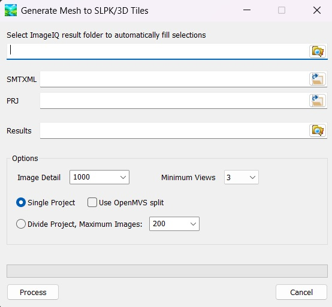
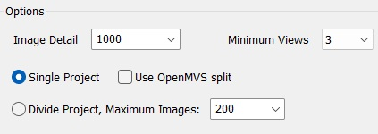
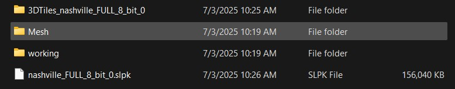
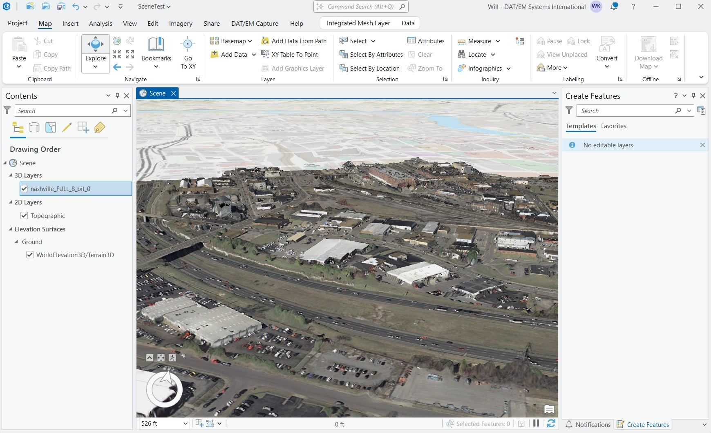
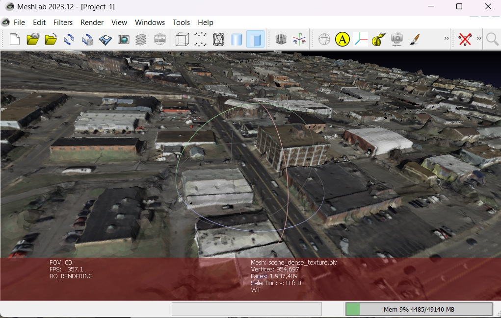

# MvsToSLPK User's Guide

The latest install is here:
https://github.com/wklechka/MvsToSLPK/releases

From Windows Start menu select:

Here is the user interface:

There are two input files: a Summit project (smtxml) and a PRJ. The PRJ is a file containing the PROJ WKT coordinate system. The smtxml is an XML file used by DAT/EM's Summit Evolution™ stereoplotter application.

The output will go to the selected 'Results' folder.

If you are an ImageIQ™ user you can select your ImageIQ results folder and the SMTPRJ, PRJ and Results folder will be filled in automatically.

## Options Explained:

The most import option is Image Detail. This controls how much memory you will use and how detailed the ending mesh will be.  Using the default of 1000 is quite small, but you will be able the run most projects at this level without any division or splitting. Run the project with a small image detail first.  It will run relatively fast this way and use minimal memory.  Get results first before trying to increase the detail. 

Option Minimum Views (2, 3, or 4). The minimum number of views needed for a point to be considered. The default is 3. Use 2 for datasets with a low number of overlaps between images. Use 3 for typical datasets. Use 4 for projects with lots of overlapping imagery.

How to deal with large projects:

The preferred method is "Single Project" without "OpenMVS split". This results in a single mesh and a single SLPK.  The "Use OpenMVS split" is really only here for completeness. OpenMVS has its own method of splitting up a project; I don't recommend this way, but it can be attempted for those who that want to try it or are familiar with its use.

"Divide Project" splits up the project into multiple projects. It does this by using a Quad Tree and continuously dividing up the imagery into quarters until each rectangle is less than the Maximum Images. The results will be a mesh/SLPK for each generated project.  Each project is treated individually.

## Expected Results:

Sample folders layout:

Sample SLPK in Esri® ArcGIS® Pro:

Sample Mesh PLY in MeshLab:

